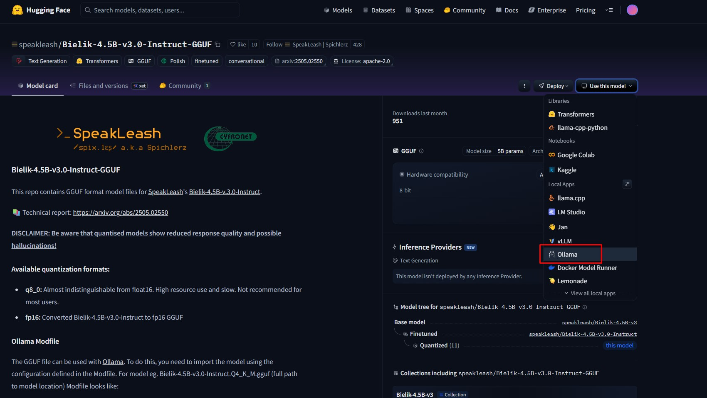
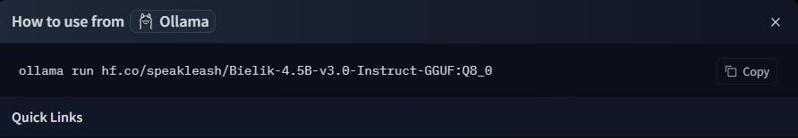

# Run a Hugging Face model locally with Ollama

Use this quick guide to pull a GGUF model directly from Hugging Face into Ollama and run it locally (no external API calls). The example uses `hf.co/speakleash/Bielik-4.5B-v3.0-Instruct-GGUF:Q8_0`, which is already referenced in `python/ollama_api_project_with_pca/app/config.py`.



## Understanding the command
- `ollama run` starts a new Ollama session.
- `hf.co/speakleash/Bielik-4.5B-v3.0-Instruct-GGUF` points to the GGUF model on Hugging Face.
- `:Q8_0` is the quantization label (8-bit) that shrinks memory and disk use while keeping quality reasonable for this 5B parameter model.



## Prerequisites
- Windows, macOS, or Linux with Ollama installed and running (`ollama serve` starts automatically on Windows/macOS installs).
- Enough disk and RAM/VRAM for Q8_0 (roughly 5B params). Plan for at least 8 GB RAM; 16 GB or more is recommended for smoother responses, plus enough free disk for the download and cache.
- Internet access the first time you pull the model (later runs use the local cache).

## Steps to run
1) Install Ollama if needed  
   - Download from https://ollama.com/ and follow the installer for your OS.
2) Open a terminal or PowerShell window.
3) Run the command to pull and start the model  
   ```bash
   ollama run hf.co/speakleash/Bielik-4.5B-v3.0-Instruct-GGUF:Q8_0
   ```
   - First run downloads the GGUF from Hugging Face and sets it up in Ollama (may take a few minutes).
   - After the download, an interactive prompt appears; type your prompt and press Enter to chat.
4) (Optional) Create a shorter local alias  
   ```bash
   echo FROM hf.co/speakleash/Bielik-4.5B-v3.0-Instruct-GGUF:Q8_0 | ollama create bielik -f -
   ollama run bielik
   ```
   - This tags the pulled model as `bielik` for quicker reuse.

## Notes and troubleshooting
- RAM constraints: with less than 8 GB, inference can be very slow or fail; close other heavy apps to free memory.
- Download issues: check internet connectivity and disk space; rerun the command to resume.
- Slow responses: shorten prompts, reduce concurrent system load, or try a smaller quantization if available.
- Using with this repo: if the FastAPI service is running, restart it after pulling the model so Ollama can serve it to the app.

## Quick test prompt
```bash
ollama run hf.co/speakleash/Bielik-4.5B-v3.0-Instruct-GGUF:Q8_0 "Write a short summary of the API-4-Your-AI project."
```
