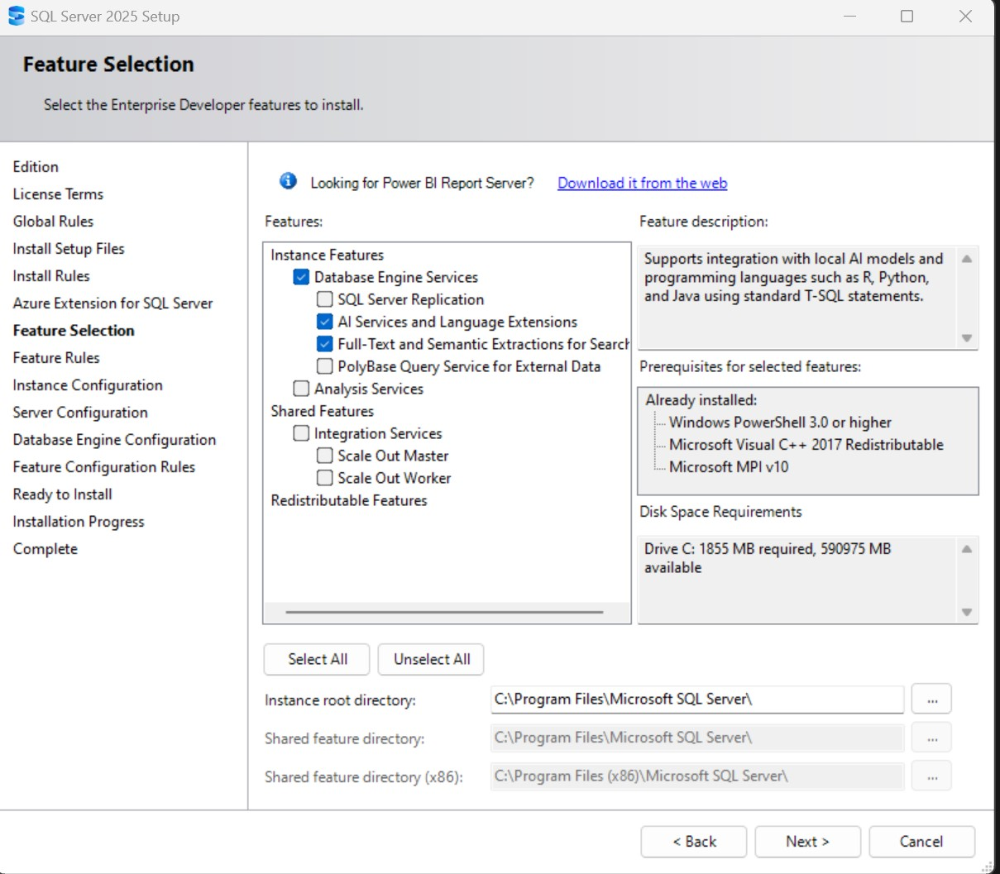

# SQL Server 2025 installation (required features)

Use this checklist to install SQL Server 2025 with the features needed for the AI + vector demos in this repo.

## What you need
- Windows with administrator rights (installer elevates and writes services).
- SQL Server 2025 media (Enterprise/Developer edition).
- ~2 GB free disk for engine + AI components; more for databases and backups.
- Prereqs the installer will confirm: Windows PowerShell 3.0+, Microsoft Visual C++ 2017 Redistributable, Microsoft MPI v10.

## Feature selection (required)
During setup, on **Feature Selection**, enable these checkboxes:
- `Database Engine Services` - core engine plus external REST endpoint support.
- `AI Services and Language Extensions` - required for in-database AI, Python/R, and the external REST integration used in this repo.
- `Full-Text and Semantic Extractions for Search` - needed for semantic search/vector scenarios and the sample scripts.

Leave the other items unchecked unless you specifically need them:
- `PolyBase Query Service for External Data`, `Analysis Services`, and `Integration Services` are not required for the repo samples.
- Scale Out options stay off unless you run SSIS scale-out.

Keep the default instance root directory unless you have a reason to change it.

## Post-install sanity checks
- Confirm the SQL Server service starts (`MSSQLSERVER` or named instance).
- Install the latest ODBC Driver 18 if not already present (used by the Python vectorizer).
- Run the SQL scripts under `sql/SQL AI` to enable external REST endpoints and vector search features after installation.
